# 使用说明

安装软件或从web端打开后进入首页

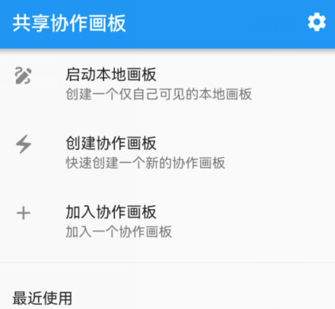

点击右上角设置按钮进入白板设置，设置MQTT服务器地址与端口

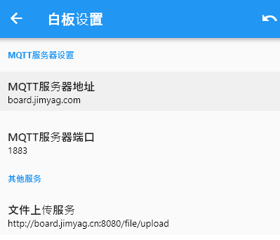

> 默认提供的地址：
> MQTT服务器地址：board.jimyag.com
> MQTT服务器端口：1883
> 文件上传服务：http://board.jimyag.cn:8080/file/upload

## 本地白板

进入首页后点击‘启动本地画板’，可创建一个仅自己可见的本地画板。该画板可以为您提供完全私密的服务，您可以在这里自由的享受创作时间。通过点击画板右上角，您可以将所创建的白板保存到本地备份以防数据丢失，并且可以点击“项目信息”来查看当前画板的页数。

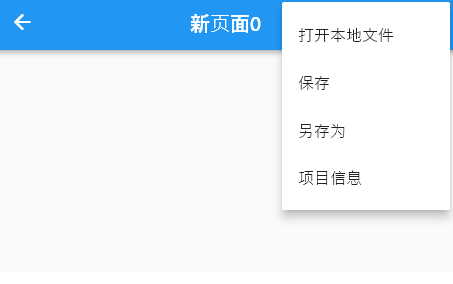

## 协作白板

进入首页后点击‘创建协作画板’，可快速创建一个新的协作画板，并且可在白板右上角选择“白板模式设置”自由切换“**主持人模式**”和“成员模式”

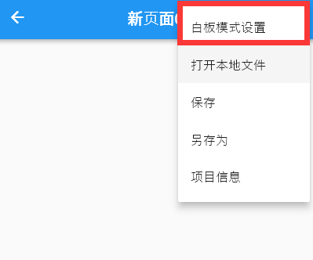

### 主持人模式

在本模式中，仅有主持人可对白板进行编辑，其余成员只可进行观看。

### 成员模式

在本模式中，所有成员均可对白板进行编辑。

## 白板主要功能

### 页面标题

点击位于上方中央的页面标题可以修改标题或者添加新页，页码会按顺序显示在“添加新页下方”

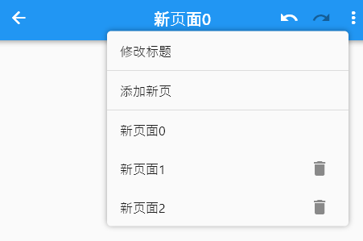

### 添加模型/清空画布

在PC端鼠标右击白板或者在移动端白板空白区域，选择“添加模型”。

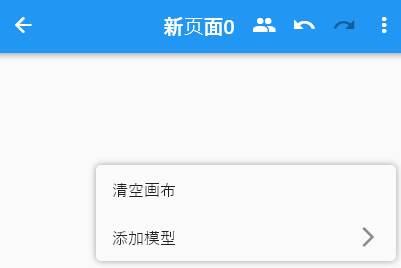

可自由选择想要添加的模型呈现在画布上，如果希望一次删除所有模型，可选择清空画布。

### 矩形框/文本框

我们可以对每一椭圆图形单独进行旋转、自由缩放、删除、更换图形颜色的操作。

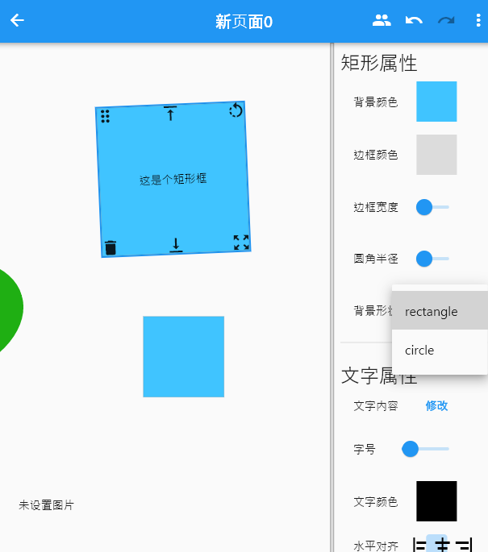

双击矩形框会弹出修改文字窗口，如果删除窗口中所有文字会展示 一个矩形。

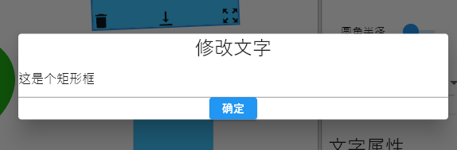

如果在背景形状里设置为circle则会变为一个圆形的文本框。我们还可以通过修改文字属性来修改文字内容与文字对齐。

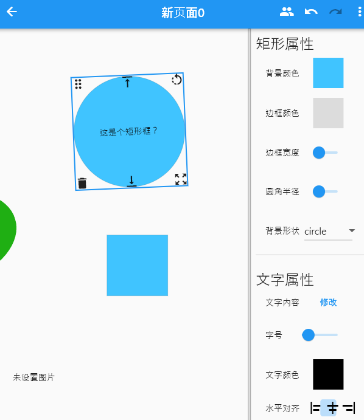

### 椭圆

我们可以对每一椭圆图形单独进行旋转、自由缩放、删除、更换图形颜色的操作

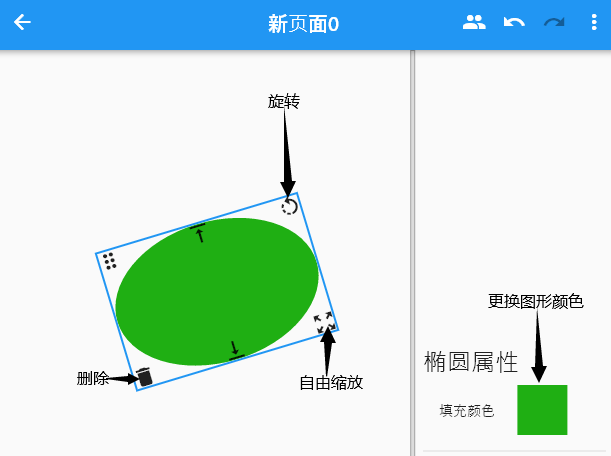

我们提供颜色拾取器来未模型更换颜色。

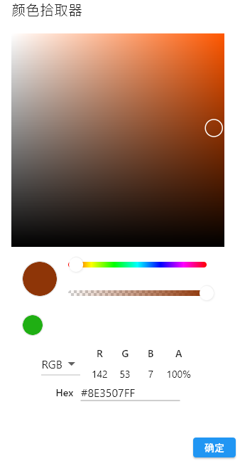

### 图像

添加图片模型后我们可以通过修改图片进行图片的上传与修改，我们为提供了多种图片填充方式来适配白板。若觉得图片过小想查看原图，可点击“查看图片”对图片进行查看。

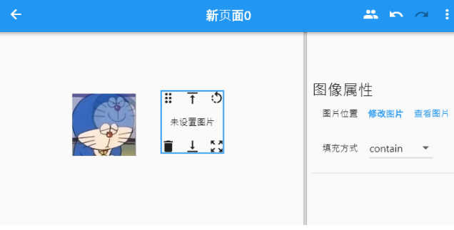

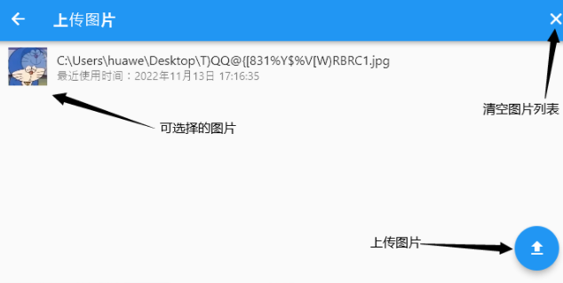

### 附件文件

白板提供附件的上传与下载，点击“修改附件”可以选择文件进行上传，其他用户可点击下载附件进行下载。

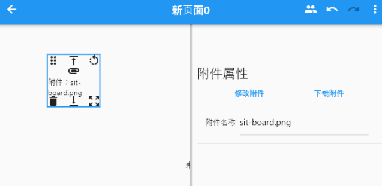

### 自由画板

自由画板模式下可以创建一个可书写框，可对其内容进行自由的编写，可以通过颜色拾取器来对画板和画笔的颜色和颜色透明度进行设置

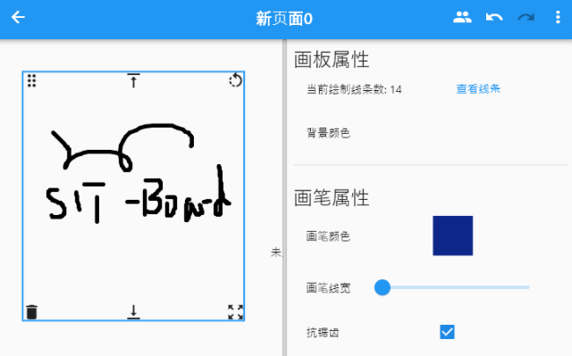

### HTML文档

可以写带格式的富文本，比如对文字加粗，文字斜体，添加表格，插图等，来实现更加丰富的显示效果。

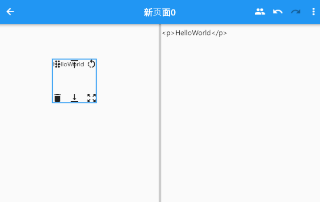

### Markdown文档

它时对html文档语法的一种简化，其显示效果及作用与html文档相同。

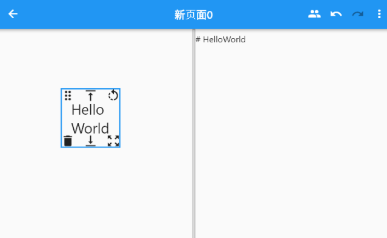
