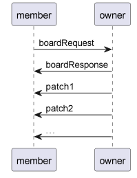

# 核心算法实现

## json_field_modifier

该算法库使用example代码如下：

```dart
final map = {
  'a1': {
    'a2': 123,
    'b2': true,
    'c2': [1, 2, 3],
  },
  'b1': 123,
};
final fm = FieldModifier(map);
print(fm.get(['a1', 'c2'])); // [1,2,3]
print(fm[['a1', 'c2']]); // [1,2,3]
print(fm['a1.c2']); // [1,2,3]
print(fm.get(['a1', 'c2', 2])); // 3
print(fm[['a1', 'c2', 2]]); // 3
print(fm['a1.c2.2']); // 3
fm['a1.c2.1'] = 666;
print(fm['a1.c2.1']); // 666
print(getPathList(map)); // [['a1','a2'],['a1','b2'],['a1','c2'],['b1']]
```

获取数据与修改数据就是递归地查询，获取所有路径列表就是使用深度优先遍历算法实现的。
具体算法可查看对应模块下的代码

## json_diff_patcher

json_diff_patcher包用于对比两个HashMap之间的差异，得出变更后的HashMap的新增，删除，修改的字段内容。json diff算法的核心思想便是扁平化json并进行集合的差集运算。扁平化json是基于json_field_modifier包实现，差集运算使用dart内置集合框架实现，具体代码可自行查看对应modules下的代码库。

该算法库使用example的代码如下

```dart
import 'dart:convert';

import 'package:json_diff_patcher/json_diff_patcher.dart';

dynamic copy(dynamic json) {
  return jsonDecode(jsonEncode(json));
}

final sourceMap = {
  'a': 123,
  'b': 321,
  'c': [2, 3, 4],
  'd': [3, 4, 5],
  'e': {'e1': 333, 'e2': 22222},
};
final targetMap = copy(sourceMap);

void main() {
  // update a = 'a1''
  targetMap['a'] = 'a1';
  // add f = 'f1'
  targetMap['f'] = 'f1';
  // add c.3 = 2
  targetMap['c'].add(2);
  targetMap['e']['e2'] = 345;
  targetMap['e']['e2'] = 345;
  (targetMap['e'] as Map).remove('e1');

  final patcher = JsonDiffPatcher(sourceMap);
  final patch = patcher.diff(targetMap);
  print('source: $sourceMap');
  print('target: $targetMap');

  // {"add":{"f":"f1"},
  //  "remove":{"e.e1":333},
  //  "update":{
  //    "a":{"source":123,"target":"a1"},
  //    "c":{"source":[2,3,4],"target":[2,3,4,2]},
  //    "e.e2":{"source":22222,"target":345}}}
  print('patch: $patch');

  patcher.applyPatch(patch);
  print('source += patch: $sourceMap');

  patcher.applyPatch(patch.inverse());
  print('source -= patch: $sourceMap');
}
```

## json_model_undo_redo

该算法库基于json_diff算法针对json_model实现了一个增量式的undo redo算法。

undo redo的算法为json_diff算法，得出每一步的差异。使用一个数组/链表存放每一步diff出的patcher，通过一个指针记录当前状态在数组/链表中的位置，则undo操作就是回退指针并反向应用patcher，redo操作就是前进指针并正向应用patcher。

注意：当undo到历史的某一状态后再次发生新的状态的改变，则相当于建立了一条新的变化分支，原来的分支可能会无意义，故该包仅在这种情况下将删除原来的旧分支，即undo到某一步后若发生变更，则无法再redo。

具体使用如下,

```dart
import 'package:json_model_undo_redo/json_model_undo_redo.dart';
import 'package:test/test.dart';

class MyState {
  final Map map;
  int get counter => map['counter'] ??= 0;
  set counter(int v) => map['counter'] = v;

  MyState(this.map);
}

void main() {
  test('test undo redo', () {
    // 初始状态0 counter = 0
    final state = MyState({})..counter = 0;
    final undoRedo = UndoRedoManager(state.map);
    expect(state.counter, equals(0));
    expect(undoRedo.canUndo, isFalse);
    expect(undoRedo.canRedo, isFalse);

    // 状态1 counter = 4
    state.counter = 4;
    undoRedo.store();

    expect(state.counter, equals(4));
    expect(undoRedo.canUndo, isTrue);
    expect(undoRedo.canRedo, isFalse);

    // 回滚到状态0
    undoRedo.undo();
    expect(state.counter, equals(0));
    expect(undoRedo.canUndo, isFalse);
    expect(undoRedo.canRedo, isTrue);

    // 重做到状态1
    undoRedo.redo();
    expect(state.counter, equals(4));
    expect(undoRedo.canUndo, isTrue);
    expect(undoRedo.canRedo, isFalse);
  });
}
```

## json_model_sync

json_model_sync是基于json_diff_patcher实现的一套先完整后增量的json_model同步算法。

其底层通信使用的是MQTT来进行各个节点之间的同步。MQTT是发布订阅机制的一个消息传输的实现。

同步有两种角色，分别为owner和member。其对应于画板中的主持人与成员。

owner和member均需要定时发布report消息向其他节点说明其在线状态。

**具体的同步消息流程**

owner节点拥有完整的json_model数据，当其他节点进入某房间时，有消息流程如下：

1. 其他节点在某个房间发送广播boardRequest消息
2. owner收到boardRequest后需要向广播发起人传递完整的json_model数据boardResponse
3. member收到boardResponse数据，并将等待期间的patcher应用到board数据上，刷新本地model副本
4. owner将定时发布model的更新patch
5. member将订阅owner发来的patch更新自己的model数据


